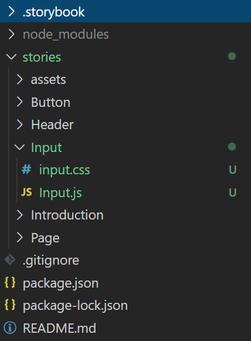
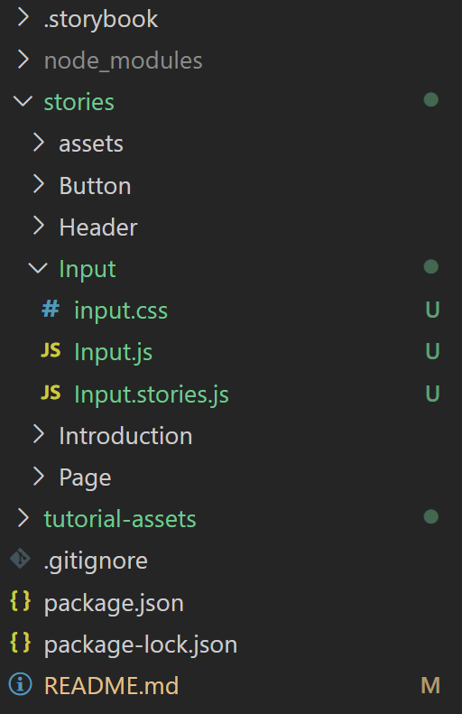
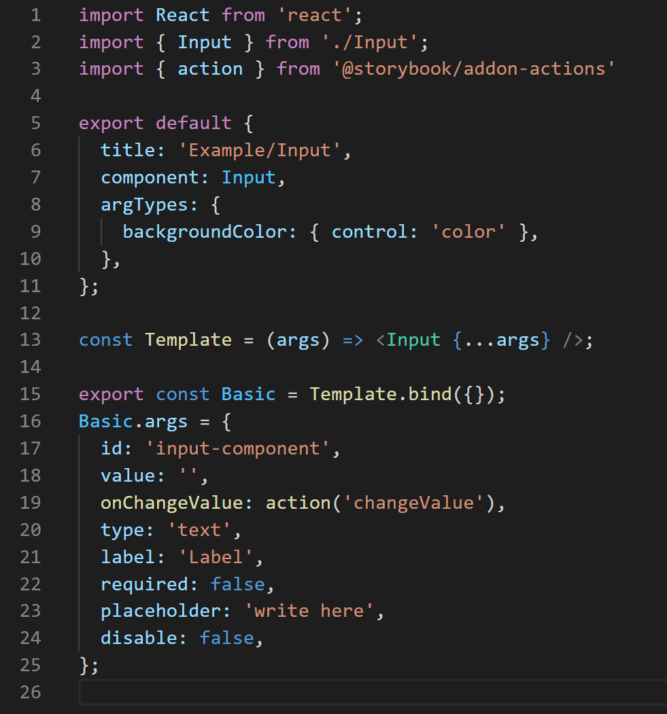
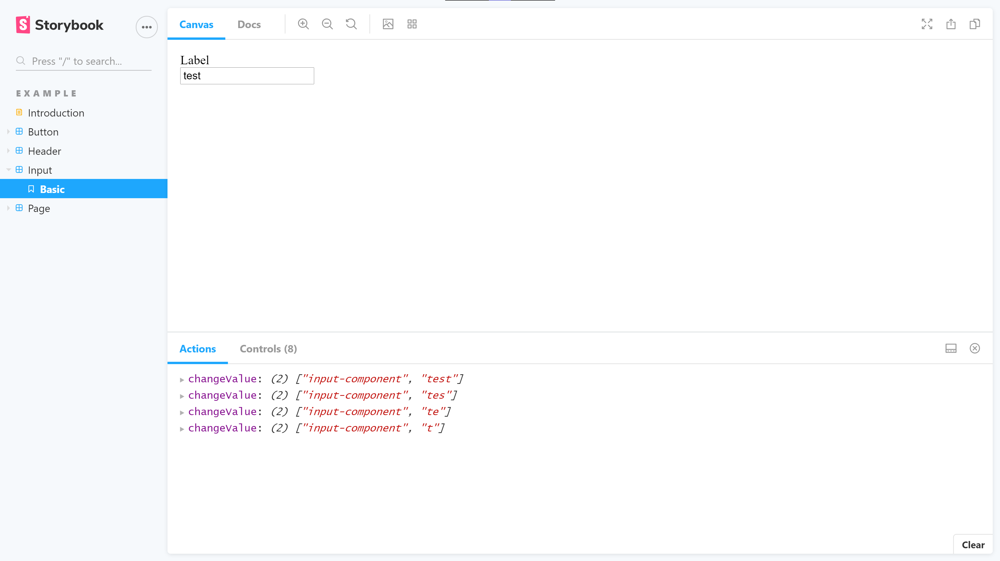
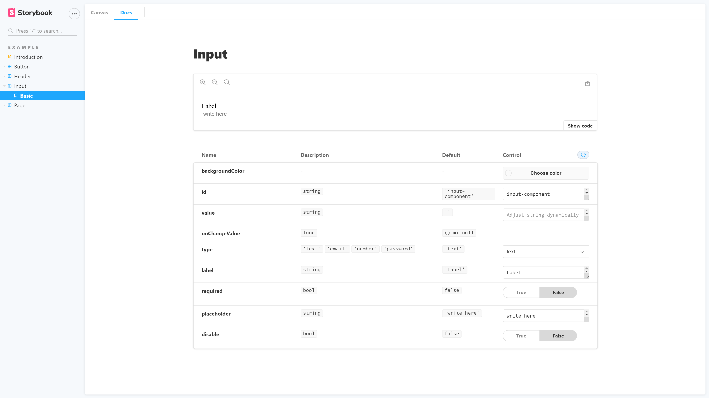

[](https://storybook.js.org/)
# Instalación
Para instalar e iniciar el proyecto ejecutamos:
```bash
$ npx sb init
```
Al ejecutar el comando se preguntará si se desea elegir el tipo de proyecto del storybook (framework a utilizar), en este caso respondemos 'Yes' y seleccionamos la opcion 'REACT'
Para verificar la instalación e iniciar el storybook ejecutamos:
```bash
$ npm run storybook
```
## Guía de instalación completa de Storybook
https://storybook.js.org/docs/react/get-started/install
## Instalación de herramientas para tests
https://jestjs.io/docs/en/getting-started
# Tarea
El objetivo es construir un input component que tenga por lo menos las siguientes características:
 - Recibe las propiedades: id: string, value: string, onChangeValue: () => void, required: boolean, error: string, disabled: boolean
 - La propiedad onChangeValue se debe ejecutar siempre que exista un cambio en el valor del input.
 - Si el input es de tipo numérico debe cambiarse el valor del input solo si el texto ingresado es de tipo numérico.
# Crear test para el componente
 - Para asegurarnos del correcto funcionamiento del componente, vamos a realizar 4 test que cubran los criterios de aceptación.
 - Cuando se realizan test para componentes, queremos como primer caso que se renderice el componente correctamente.
Para más información sobre la librería y tests sobre react:
https://testing-library.com/docs/react-testing-library/intro
# Crear un componente
 - Creamos una carpeta dentro de *stories/* con el nombre del componente
 - Dentro de este creamos el archivo *.js* y *.css* correspondientes
 - Creamos un componente individual de React como normalmente lo realizaríamos
> El árbol de archivos puede ser organizado de cualquier manera deseada, se ha seleccionado la mas explicativa para un funcionamiento básico
> En este paso no se podrá probar el funcionamiento del componente ya que para eso requerimos ya crear un Story
### Árbol de archivos
Creación de las carpetas y archivos
<p align="center">
  
</p>

# Crear un story
  - Dentro de la carpeta designada para el componente creamos el archivo *.stories.ts*
    - Aquí se deberá definir cada uno de los stories que queramos presentar
    - En la version actual (6.0.13) la documentación y controles base serán automáticamente implementados
## Ejemplo
### Árbol de archivos
<p align="center">
  
</p>

### Input.stories.js
<p align="center">
  
</p>

## Resultado
<p align="center">
  
</p>
<p align="center">
  
</p>